repo: [github.com/andrewbtran/docker_sample_project](https://github.com/andrewbtran/docker_sample_project)

slides: [andrewbtran.github.io/docker_sample_project/presentation/docker_and_r.html](andrewbtran.github.io/docker_sample_project/presentation/docker_and_r_slides.html)

doc: [andrewbtran.github.io/docker_sample_project/presentation/docker_and_r.html](andrewbtran.github.io/docker_sample_project/presentation/docker_and_r_doc.html)

# What's the point of an R server?

You can host: 

## Shiny apps 

[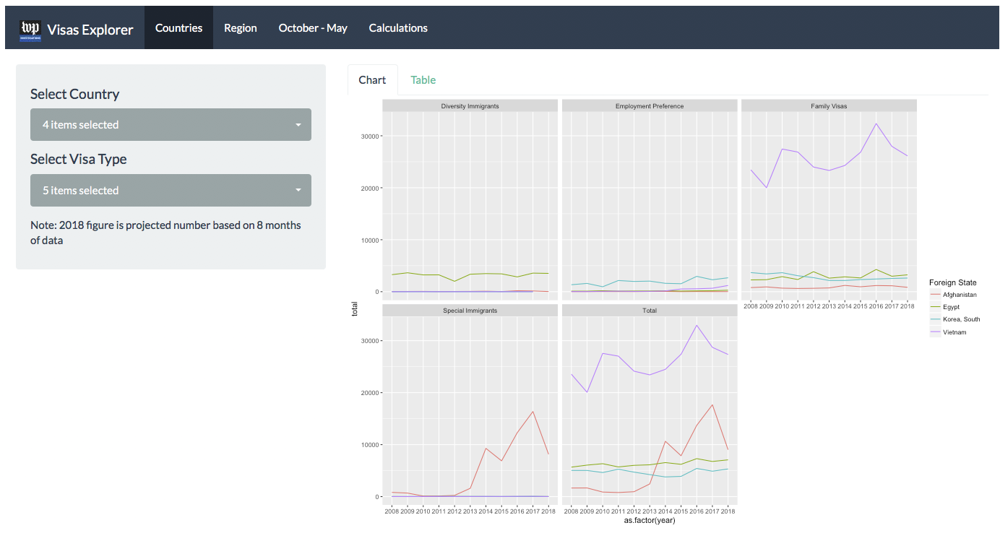](https://github.com/wpinvestigative/immigrant_visas)

## R Notebooks

[](https://github.com/wpinvestigative/helicopters_dc)

## Learnr tutorials

Make your own code acadamy type of courses.

[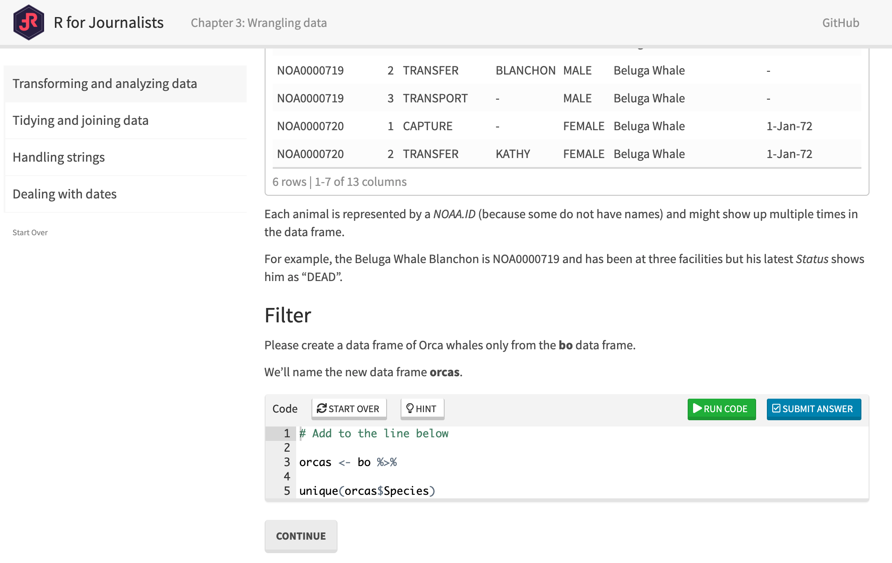](https://github.com/r-journalism/learn-chapter-3)

## Rstudio Cloud

Spend a few dollars to spin up a server with 32 cores and 192 GB of ram for a few hours for complex data analysis.

[](https://rstudio.cloud/)

## API with Plumber

[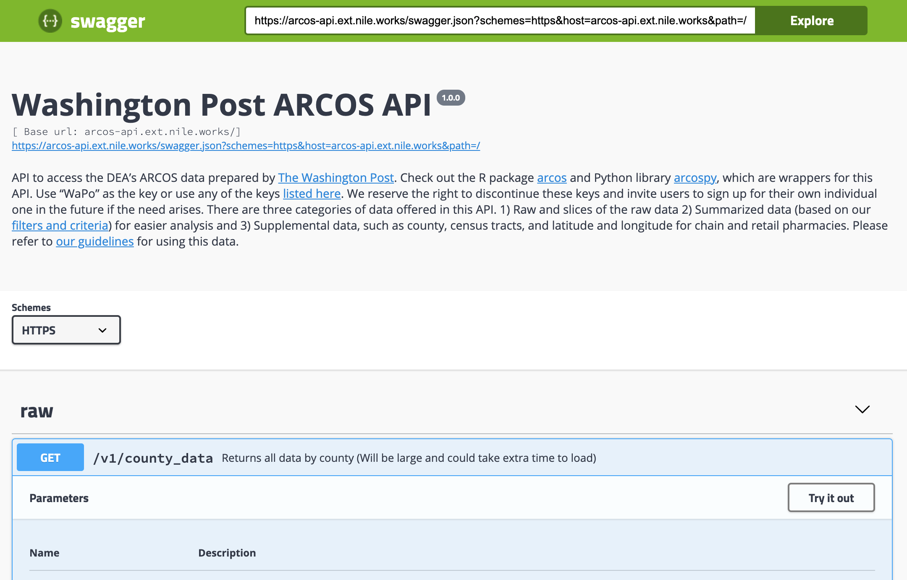](https://arcos-api.ext.nile.works/__swagger__/)

## Host models

Washington Post Python data munging + R modeling + Plumber API = Live election predictions

[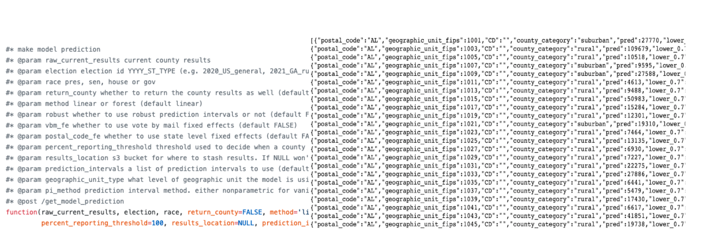](https://github.com/washingtonpost/2020-election-night-model)

## Host models

Washington Post Python data munging + R modeling + Plumber API = Live election predictions

[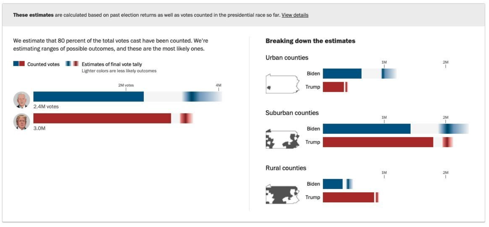](https://www.washingtonpost.com/elections/)


# What are your options?

1. Hosting Rmarkdown for free: [Github Pages](https://www.washingtonpost.com/elections/)
2. Hosting Shiny apps (not free): [shinyapps.io](https://www.shinyapps.io/)

[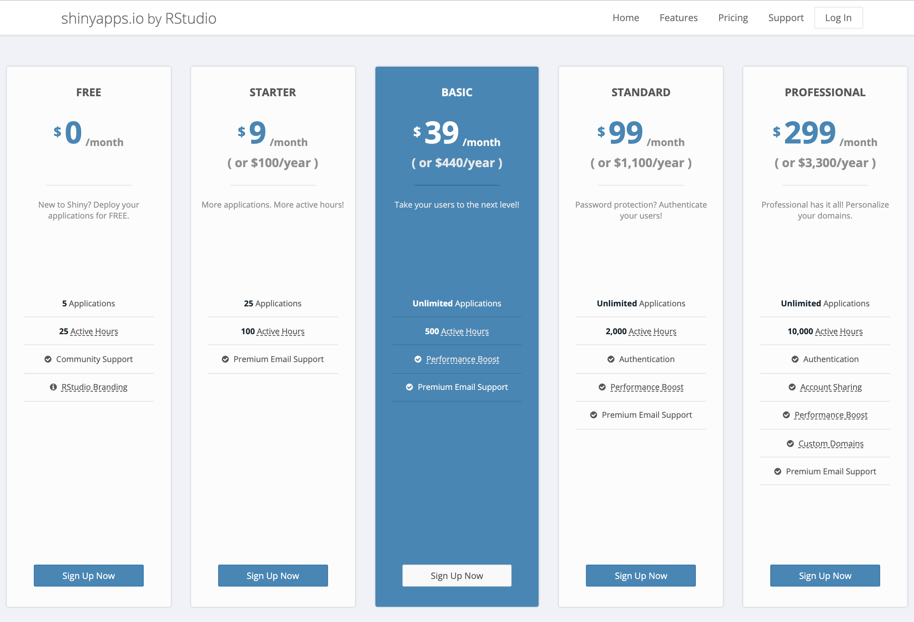](https://www.shinyapps.io/)

# Host it yourself

* Digital Ocean
  * [R on Digital Ocean](https://www.dfoster.science/post/r-on-digital-ocean/)
  * [Create RStudio Droplet](https://marketplace.digitalocean.com/apps/rstudio)
  * Get [$100 credit](https://m.do.co/c/bda999dcecfd)
* Heroku
  * [Deployiing an R Shiny app on Heroku free tier](https://medium.com/analytics-vidhya/deploying-an-r-shiny-app-on-heroku-free-tier-b31003858b68)
* AWS
  * [The Ultimate Guide to Deploying a Shiny App on AWS](https://www.charlesbordet.com/en/guide-shiny-aws/)
  * [How to run RStudio on AWS in under 3 minutes for free](https://medium.com/analytics-vidhya/deploying-an-r-shiny-app-on-heroku-free-tier-b31003858b68)
  * [Using docker to deploy an R plumber API](https://medium.com/tmobile-tech/using-docker-to-deploy-an-r-plumber-api-863ccf91516d)
* Google Cloud Run
  * [R Studio Server on Google Cloud](https://towardsdatascience.com/r-studio-server-on-google-cloud-dd69b8bff80b)
  * [googleCloudRunner](https://code.markedmondson.me/googleCloudRunner/articles/cloudrun.html)

# Digital Ocean for Personal Use and AWS at Work

**Digital Ocean**

* Good pricing and [documentation](https://www.digitalocean.com/docs/)
* One-stop-shop foor storage, domains, and can reserve a [floating IP address](https://www.digitalocean.com/docs/networking/floating-ips/)
* Sync with [Dropbox Linux](https://www.dropbox.com/install-linux) for easier file exchange

**AWS (or whatever your news org uses)**

* Engineering experts to help
* Can host internally

# Steps for setting up an R server on Digital Ocean

* Create a Droplet for your project
 * Choose an image wiith at least 1GB of ram
 * Choose a plan
 * Add block storage
 * Choose data center
 * Select SSH keys for authentication
 * Choose a hostname for your droplet
 * Assign a floating IP address
 * Point your domain to the floating IP address
 
More specific instructions [here](https://www.dfoster.science/post/r-on-digital-ocean/)

## Steps for setting up an R server on Digital Ocean

* Access Droplet via Command Line
  * Configure proper SSH credentials via root access

* More SysAdmin tasks
  * Set up non-root user with ssh login that has sudo privileges
  * Set up SSL certificates
  * Write the configuration Caddyfile for ports, proxies, websockets, etc)
  
## Steps for setting up an R server on Digital Ocean

* More SysAdmin tasks to install R
  * from the command line, download and install R

```
$ sudo add-apt-repository 'deb https://cloud.r-project.org/bin/linux/ubuntu focal-cran40/'
  
$ sudo apt update

$ sudo apt install r-base
```

More specific instructions [here](https://www.dfoster.science/post/r-on-digital-ocean/)

## Move data over and R scripts

Create/Organize your folders through the command line

Copy a local file to your server:

```
$ scp depends.R remote_username@10.10.0.2:/remote/directory
$ Rscript depends.R
```

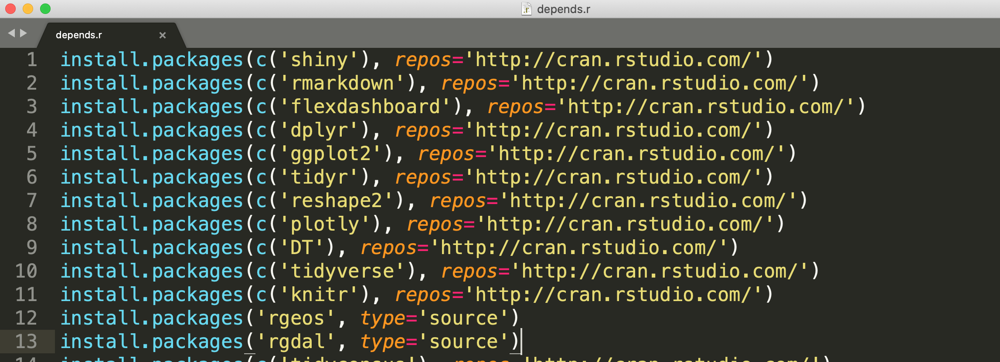

## Set up the server based on what you want

**Shiny server**

  * Install [Nginx](https://www.digitalocean.com/community/tutorials/how-to-set-up-shiny-server-on-ubuntu-16-04)
  * Install the shiny packages
  * Set up appropriate ports to listen/forward
  
**Rstudio cloud**

  * Install the Rstudio package
  * Create users for logging in to the service
  
# Simplifying the process with Docker

Brewing and drinking beer

1. **Dockerfile** - Describes the steps needed to create an environment. This is the recipe.
2. **Image** - When you execute the steps in a Dockerfile, you build the Dockerfile into an image which contains the environment you described. This is the batch of beer.
3. **Registry** - Stores built images, so that others can use them. This is akin to a liquor store.
4. **Container** - At a specific moment, you can start a container from the image, which amounts to running a process in the built environment. This is drinking a pint from the batch of beer.

## Simplifying the process with Docker

1. You can easily pour many “replicas” of the same beer.
2. The bartender (a server, in computer terms), is decoupled from the beer we want - we don’t have to go to the brewer and brew a new beer each time we want a pint.
3. As a result, the same bartender can offer many different types of beers

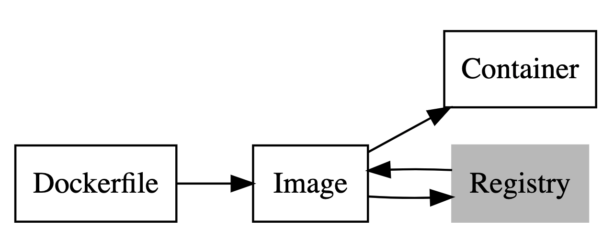

# Layers in a Docker Container

1. Base Operating System
2. System Dependencies
3. R
4. R Packages
5. Code
6. Data

## Base Operating System

`FROM rocker/shiny`

## System Dependencies

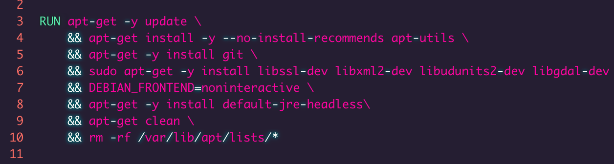

## The directory

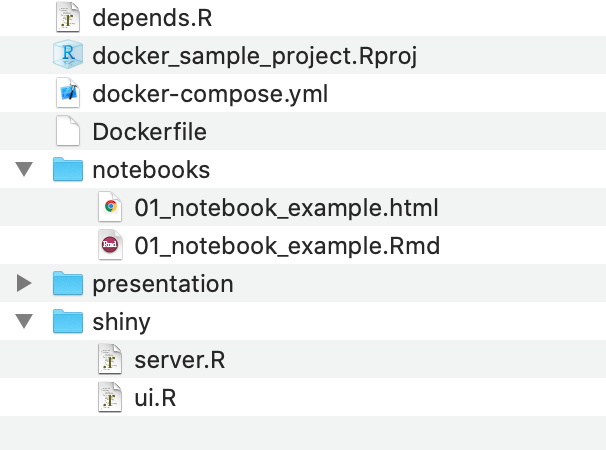

## R packages, Code and Data
 
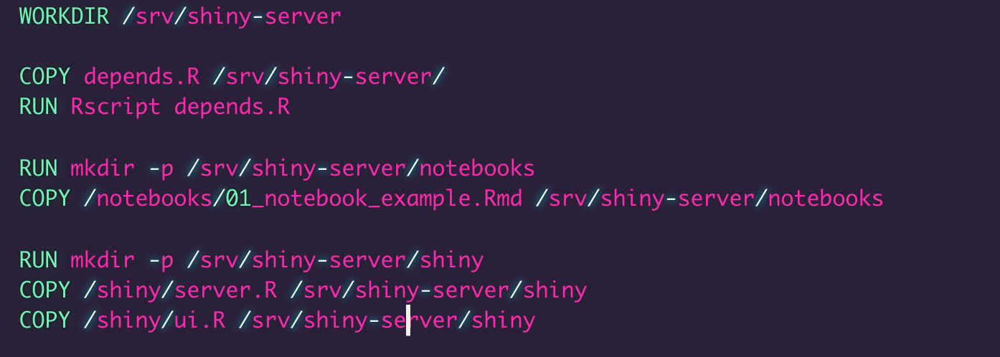
 
## docker-compose.yml

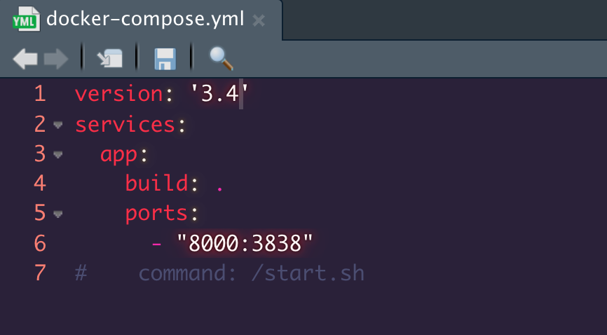

## Run Docker locally

1. Install Docker
2. Navigate to folder
3. Build out project

```
$ docker build -t docker_sample_project .
```

## Run Docker locally

4. First time building will take a while

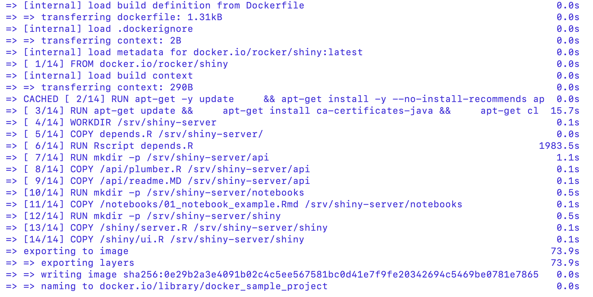

## Host docker locally

Last line in my dockerfile:

```
EXPOSE 3838
```

In the command line:

```
docker-compose down && docker-compose rm && docker-compose up --force-recreate --build
```

## Host docker locally

You can quickly figure out the local hosting address through your Docker Desktop App.

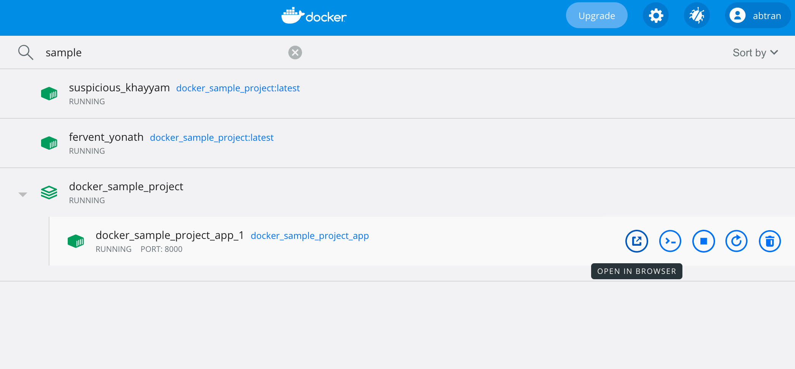

## Host docker locally

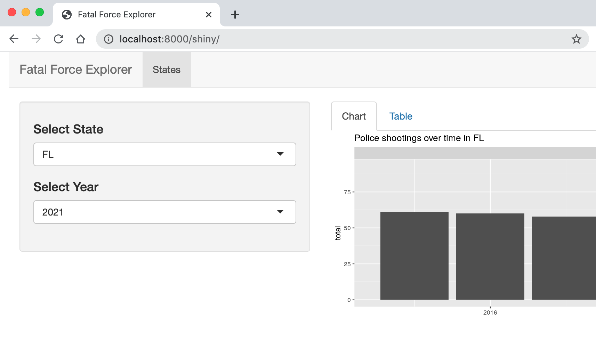

# Host docker online

Upload repo to Github

[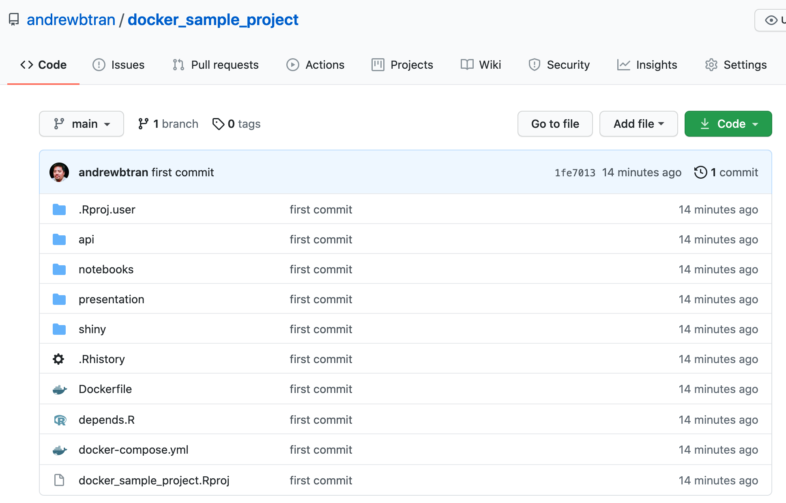](https://github.com/andrewbtran/docker_sample_project)

## Sign up for an account on hub.docker.com

[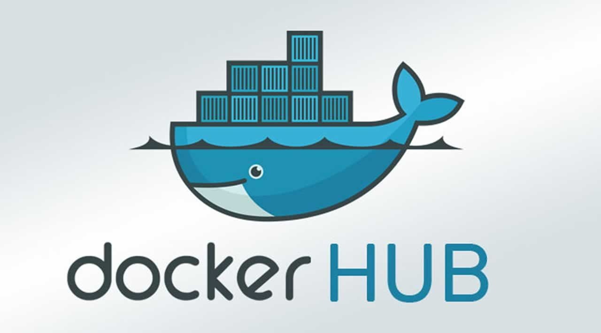](https://hub.docker.com)


## Create a Docker Repository

[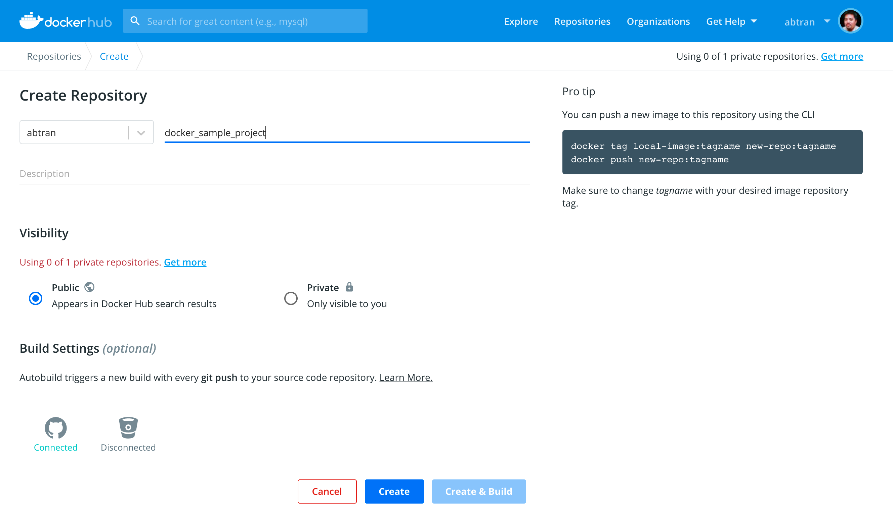](https://hub.docker.com)


## Connect your Github and Docker repos

Let it start building.

[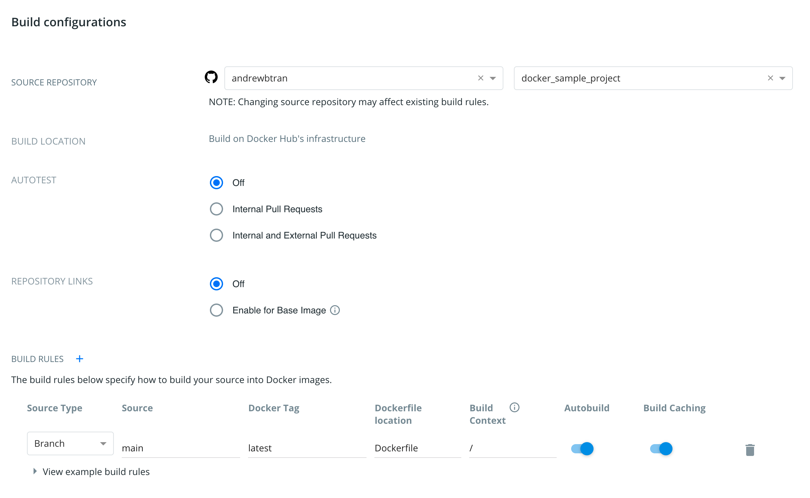](https://hub.docker.com)

## Builds now connected to Github activity

[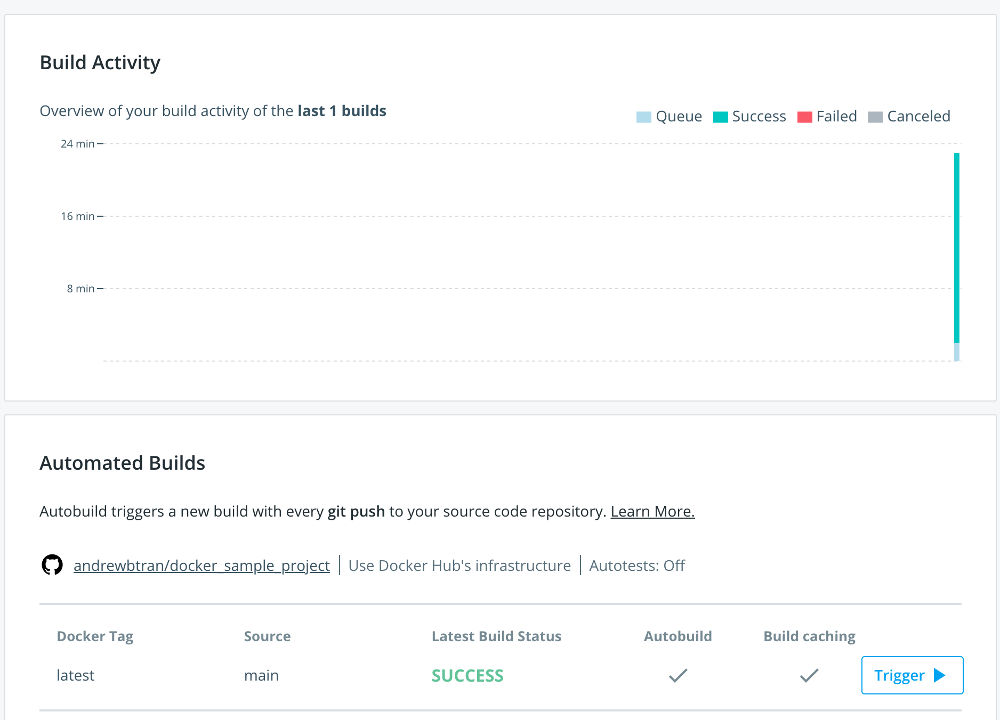](https://hub.docker.com)


## Create a Docker Droplet on Digital Ocean

Or follow the instructions on whatever hosting platform (Heroku, AWS, Cloud Run) you use to install Docker.

[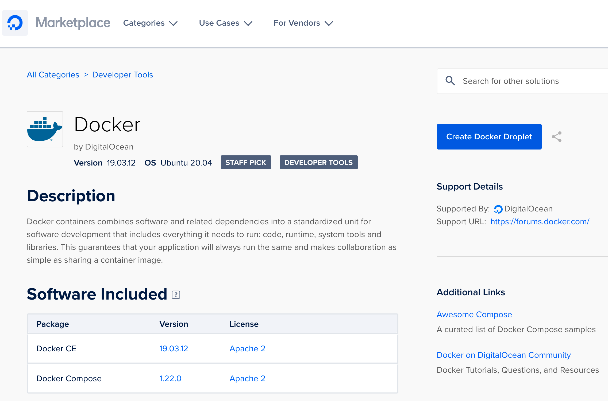](https://marketplace.digitalocean.com/apps/docker)

## Create a Docker Droplet

[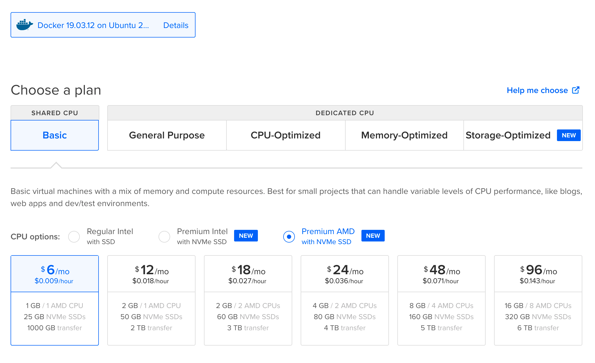](https://marketplace.digitalocean.com/apps/docker)

## SSH into server

```
$ ssh root@xxx.xx.xxx.x
```

## Deploy docker container

Make sure the R server processes are running after ending ssh session

```
$ tmux
$ docker run --rm -p 80:3838 abtran/docker_sample_project:latest
```

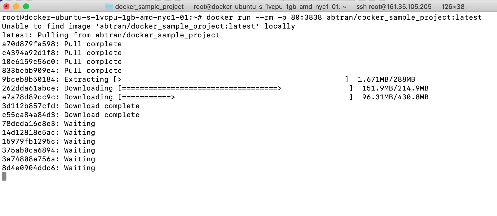

## Deploy docker container

Carefully exit the server.

Leave/detach the `tmux` session by typing `Ctrl`+`b` and then `d`

Visit your page online (in your hosting you can point it a domain name, etc).

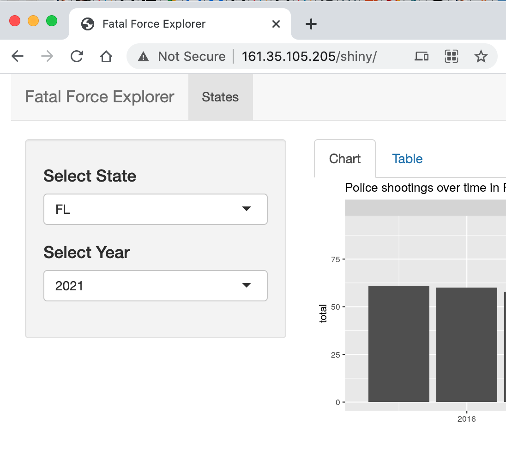

## Need to manually re deploy after every Github update

If you want to update later, ssh into your server and type

```
$ tmux attach
$ docker run --rm -p 80:3838 abtran/docker_sample_project:latest
```

Leave/detach the `tmux` concurrent session by typing `Ctrl`+`b` and then `d`

# That's it!

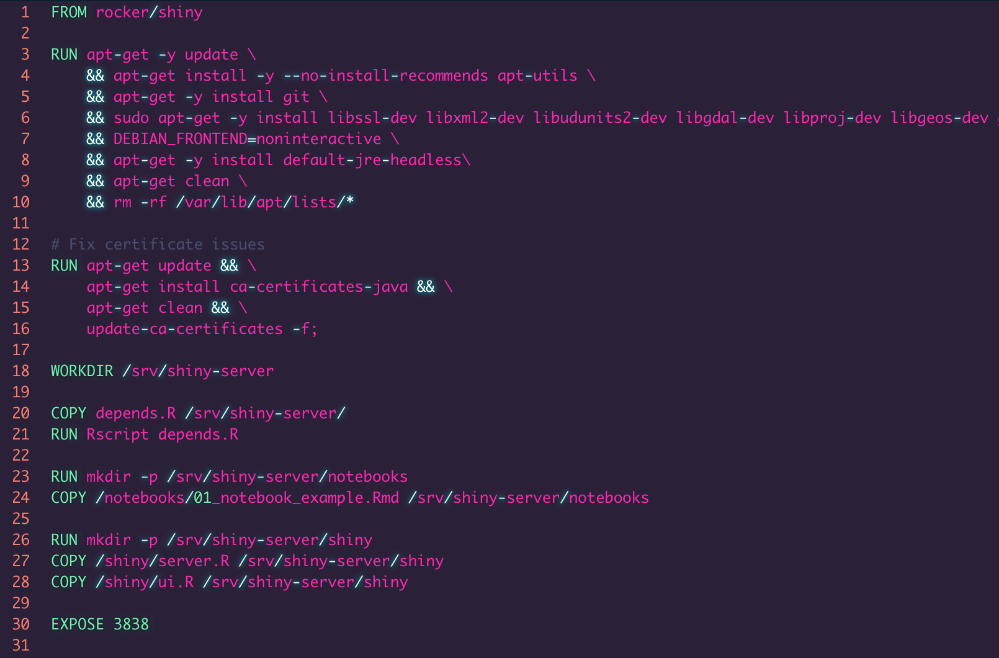
